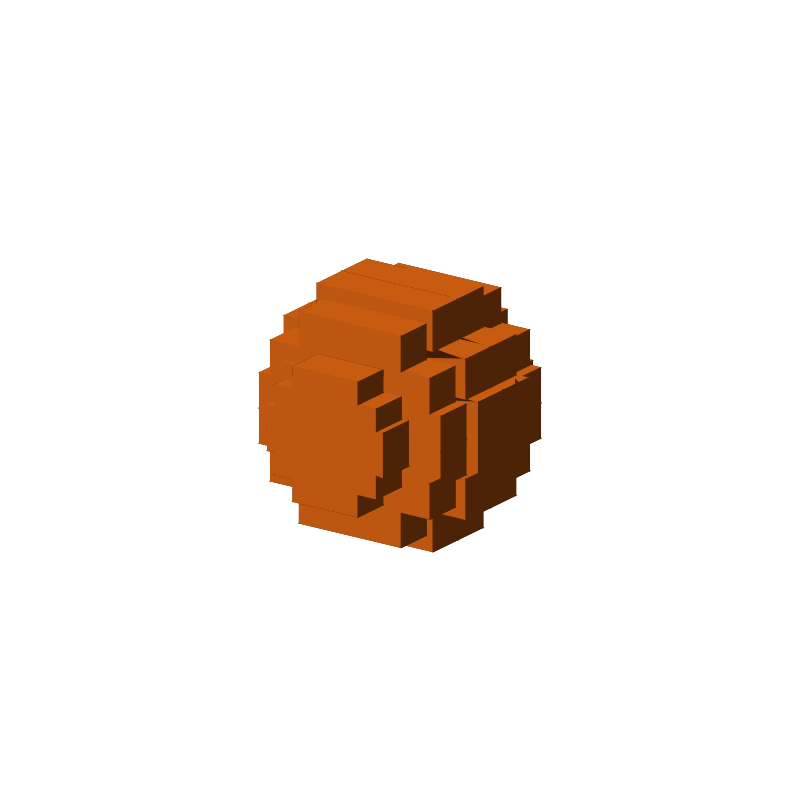
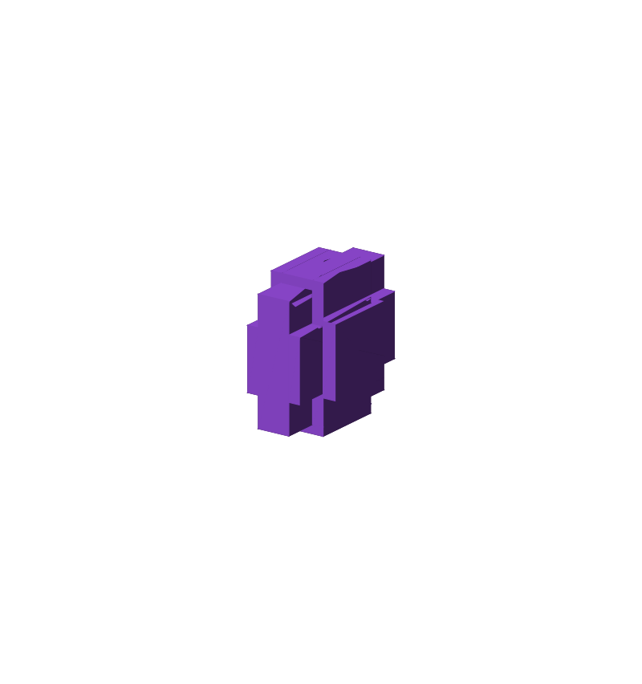
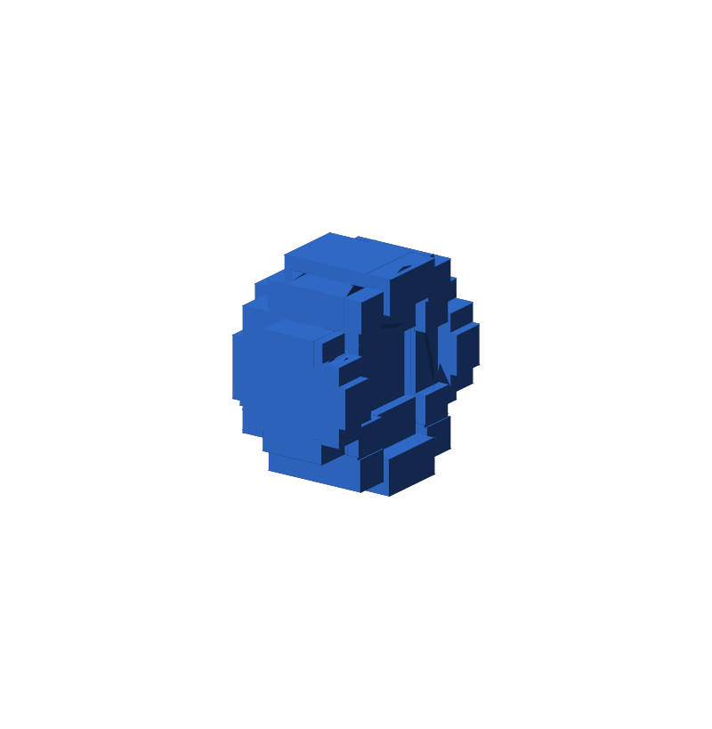
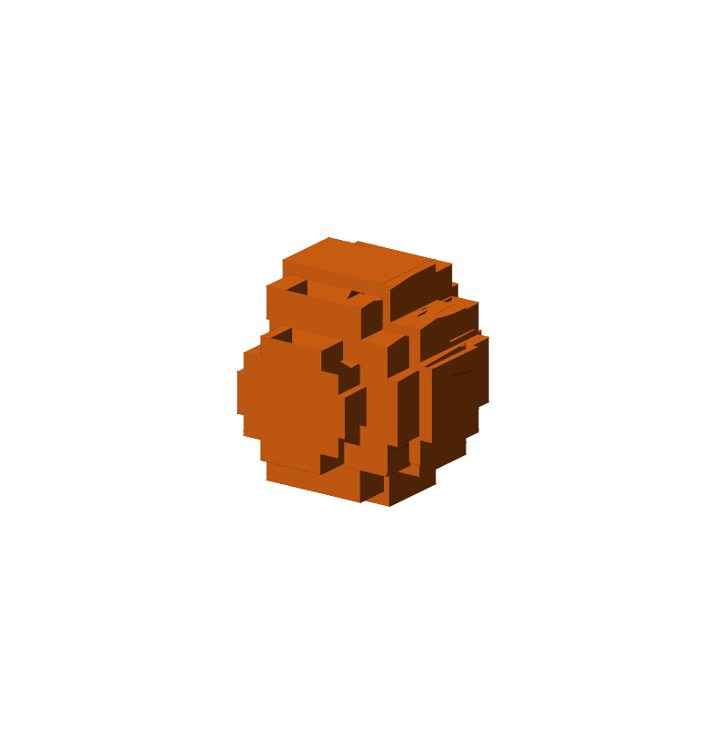
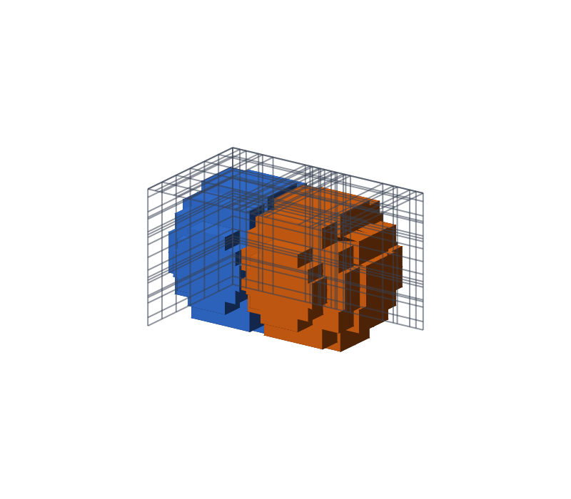

# rectilinear3d_boolean

A C++17 header-only library that computes boolean operations (`common` /
`A only` / `B only`) between two sets of axis-aligned 3D boxes, via
coordinate compression, elementary-cell classification, and greedy voxel
merging. Boxes are `ns_cg::BBox3d` from `common_geometry` -- real-valued
(`double`) coordinates.

The 3D sibling of [`rectilinear2d_boolean`](../rectilinear2d_boolean); see
that project first if you haven't -- this one follows the same shape
(`BooleanOpResult3d`, `ComputeBooleanOp3d`, `kDefaultEpsilon`) but uses a
different algorithm internally (see "Algorithm" below for why).

## Requirements

- CMake >= 3.20
- A C++17 compiler
- [Eigen3](https://eigen.tuxfamily.org/) (e.g. `brew install eigen` on macOS)
- A sibling checkout of [`common_geometry`](../common_geometry) at
  `../common_geometry` relative to this repository

## Building and testing

```sh
cmake -B build -DCMAKE_BUILD_TYPE=Debug
cmake --build build
cd build && ctest --output-on-failure
```

Note: because `common_geometry` is pulled in via `add_subdirectory`, `ctest`
also runs `common_geometry`'s own test suite alongside
`rectilinear3d_boolean`'s.

## Usage

```cpp
#include "rectilinear3d_boolean/rectilinear3d_boolean.hpp"

using ns_cg::BBox3d;
using ns_cg::Vec3d;

std::vector<BBox3d> a = {BBox3d(Vec3d(0.0, 0.0, 0.0), Vec3d(6.0, 4.0, 4.0))};
std::vector<BBox3d> b = {BBox3d(Vec3d(3.0, 2.0, 2.0), Vec3d(9.0, 6.0, 6.0))};

ns_r3b::BooleanOpResult3d result = ns_r3b::ComputeBooleanOp3d(a, b);
// result.common, result.a_only, result.b_only

// Optionally override the coordinate-matching tolerance (default
// ns_r3b::kDefaultEpsilon):
ns_r3b::BooleanOpResult3d result2 = ns_r3b::ComputeBooleanOp3d(a, b, /*epsilon=*/1e-6);
```

See `examples/demo.cpp` for a runnable version of this example.

### Visualizing results

Two spheres A and B, each approximated as a set of boxes (a nested version
of `rectilinear2d_boolean`'s circle-as-horizontal-strips decomposition:
slice into z-bands, then slice each z-band's circular cross-section into
y-strips), with `ComputeBooleanOp3d` run on the two box sets --
`examples/two_spheres_boolean_demo.cpp`. There's no clean 3D analog of the
2D project's step-by-step per-cell grid diagram (a 3D grid has far too many
cells to lay out one-by-one), but the compressed grid itself is still shown
two ways: printed as raw coordinate values, and drawn as a wireframe cage
over the actual geometry. Results are exported as follows:

**Compressed coordinates** -- the demo prints the real
`ns_r3b::detail::CompressXCoordinates`/`CompressYCoordinates`/
`CompressZCoordinates` output straight to stdout, e.g.:

```
compressed grid: 24 x-planes x 19 y-planes x 7 z-planes = 2484 elementary cells
  x (24): -4.86, -4.27, -3.75, -2.73, -2.39, -1.53, 1.14, 1.53, ...
  y (19): -4.93, -4.33, -3.29, -2.89, -2.76, -1.84, -1.64, ...
  z (7): -5.00, -3.33, -1.67, 0.00, 1.67, 3.33, 5.00
```

**Interactive** -- `.obj` files, viewable in
[`obj_mesh_viewer`](../obj_mesh_viewer) (drag and drop, then orbit freely):
`docs/obj/sphere_a.obj`, `sphere_b.obj`, `two_spheres_inputs.obj` (A and B
combined, to see the overlap in place), `two_spheres_common.obj`,
`two_spheres_a_only.obj`, `two_spheres_b_only.obj`, and
`two_spheres_result.obj` (all three regions combined).

**Static** -- one single-color mesh per file, same fixed-view convention as
`levelset3d_polygon`'s `sphere.svg`/`torus.svg`:

| `sphere A` | `sphere B` | `common` | `a_only` | `b_only` |
| --- | --- | --- | --- | --- |
|  |  |  |  |  |

**Compressed grid, drawn on the geometry** -- `docs/svg/two_spheres_grid.svg`,
a two-color (A blue, B orange) combined render of the same camera
projection as the images above, with the compressed grid's own wireframe
cage (the real `grid_x`/`grid_y`/`grid_z` values, drawn on the floor and
two back walls of their bounding box) overlaid on top -- the fine spacing
visible where the two spheres' box edges interleave near the overlap is
exactly the coordinate compression at work:



The demo also prints each region's volume, cross-checked against the box
approximation's own volume (`common + a_only` must equal sphere A's
approximated volume; `common + b_only` must equal sphere B's) -- both
match exactly. Regenerate with
`./build/examples/rectilinear3d_boolean_two_spheres_demo`.

## Algorithm

`rectilinear2d_boolean` computes its result with an event-driven sweep:
O((n+m) log(n+m)) in the number of input rectangles, and it emits maximal
merged rectangles directly as part of the sweep. Extending that sweep to
3D is possible in principle (run a 2D `ComputeBooleanOp`-like sub-problem
at each x-event, on the (y,z) cross-section), but correctly merging the
result across x-slabs gets substantially more involved than the 2D case's
two-pointer interval merge. `rectilinear3d_boolean` takes a simpler, more
directly verifiable route instead:

1. **Coordinate compression**: collect every box's min/max independently
   along x, y, and z across both A and B, and epsilon-cluster each axis
   (see "Floating-point tolerance" below) -- exactly `rectilinear2d_boolean`'s
   `ClusterCoordinates`, just run three times instead of once.
2. **Elementary-cell classification**: the compressed coordinates define a
   3D grid of `nx * ny * nz` elementary cells. Each cell's coverage by A
   (or B) is constant throughout the cell -- that's the point of coordinate
   compression -- so testing the cell's center point against each side's
   boxes (`BBox3d::Contains`) classifies it exactly, into `A only` /
   `B only` / `common` / `neither`.
3. **Greedy voxel merging**: for each label, scan not-yet-visited cells in
   `(k, j, i)` order; from each one, grow a box as far as possible in x,
   then as far as possible in y (checking the whole x-run at each step),
   then as far as possible in z (checking the whole x*y footprint at each
   step); mark the box's cells visited and emit it. Every target cell ends
   up in exactly one output box, so this is always a valid partition -- it
   just isn't guaranteed to produce the minimum possible number of boxes
   (the scan/grow order biases toward long x-runs first).

This trades the sweep's asymptotic edge (its cost depends only on the
number of input boxes) for something much easier to get right in 3D: cost
here scales with the compressed grid's cell count, `O(nx * ny * nz)`, which
is fine for the box counts a shape approximation like the sphere example
produces (tens to low hundreds of boxes per side) but would become the
bottleneck for inputs with very fine, high-aspect-ratio structure across
all three axes at once.

### Floating-point tolerance

Same as `rectilinear2d_boolean`: `epsilon` (default
`ns_r3b::kDefaultEpsilon = 1e-9`) is an absolute tolerance, and any two
input coordinates within it of each other are clustered to one canonical
value before classification runs, so near-coincident faces are treated as
exactly coincident rather than producing spurious slivers or gaps. Pick a
value appropriate to your coordinate scale.

## Directory layout

```
rectilinear3d_boolean/
├── include/rectilinear3d_boolean/   Public headers (header-only library)
├── examples/                    Runnable demos
└── tests/                       GoogleTest unit tests
```

## Complexity

Classification is `O(nx * ny * nz * (|A| + |B|))` (each cell tests its
center against every input box; fine for modest box counts, but a spatial
index would be the next step for larger inputs). Greedy merging is
`O(nx * ny * nz)` amortized -- each cell is visited a bounded number of
times across the grow-and-mark process.
